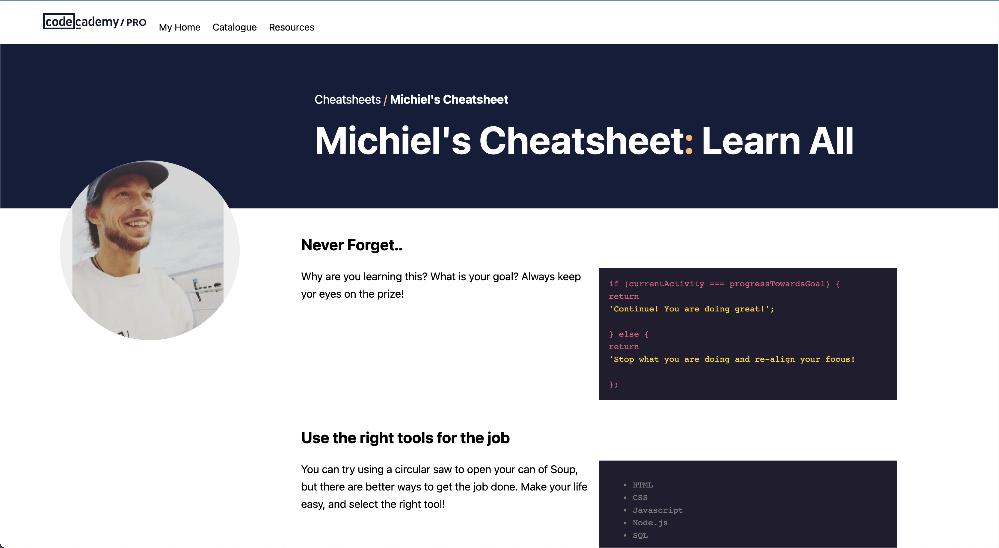
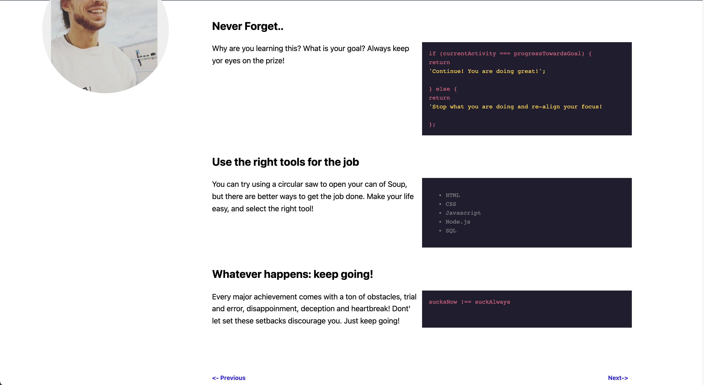

# Codecademy Cheatsheet #

## Assignment ##
Build your own cheatsheet using basic HTML & CSS

## Instructions ##
In this project, you’ll be building your own reference cheat sheet to help you build more websites in the future! Although there are great places to learn HTML & CSS like Codecademy, the best reference for yourself is often your own notes and projects.

## Feature Requirements ##
- Use an external CSS stylesheet
- Use tables to display content
- Create your own color scheme
- Custom styles for different tags

## Installation ##
Download the entire project folder to your local machine.

## Execution
Open index.html from your local project folder in your browser of choice.

## Personal comment ##
In the instruction, a dull [table style website](https://content.codecademy.com/PRO/independent-practice-projects/html-css-cheat-sheet/example/index.html) was intented to create. I decided to "copy" codecademy's own [cheatsheet format](https://www.codecademy.com/learn/learn-css/modules/learn-css-selectors-visual-rules/cheatsheet) with the techniques at hand. I added a personal touch with my profile picture

## Screenshots ## 

## Techniques ##
- HTML
- CSS
- Chrome DevTools

## Resources ##
Project base: [codecademy](https://www.codecademy.com/paths/full-stack-engineer-career-path/tracks/fscp-web-development-fundamentals/modules/fecp-challenge-project-build-your-own-cheat-sheet/projects/independent-project-html-documentation)
